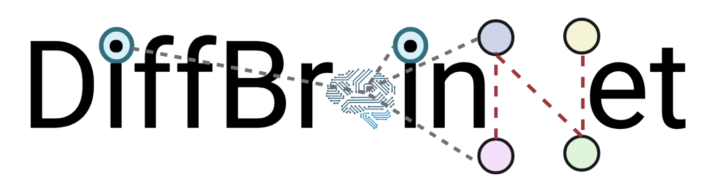

# Brain region specific gene regulation after treatment with glucocorticoids

Network analysis can identify the molecular connectivity that is underpinning function at a control level, after a stimulus or a disease state. We inferred regression-based prior-knowledge guided gene networks in 8 brain regions of the mouse brain: the prefrontal cortex, the amygdala, the paraventricular nucleus of the hypothalamus, the dorsal and ventral Cornu ammonis 1, the dorsal and ventral dentate gyrus and the cerebellar cortex. We constructed networks at baseline and treatment levels using KiMONo (Ogris et al.) and at the differential level using DiffGRN (Kim et al.).
As a stimulus we used dexamethasone, a synthetic glucocorticoid that is used to activate the glucocorticoid receptors. Glucocorticoid receptors, when coupled with glucocorticoids like dexamethasone, act as transcription factors modulating the transcriptional landscape. We provide differential networks and differential expression analysis (DESeq2, Love et al.) that can be used to analyse the effects of dexamethasone both at the molecular connectivity and at the gene level in each brain region.
DiffBrainNet is an analysis framework and a resource for studying the transcriptional landscape of 8 mouse brain regions at baseline, dexamethasone-treatment and differential levels. It can be used to pinpoint molecular pathways important for the basic function and response to glucocorticoids in a brain-region specific manner. DiffBrainNet can also support the identification and analysis of biological processes regulated by brain and psychiatric diseases risk genes at the baseline and differential levels.

## 1. Data analysis

### 1.1 Differential gene expression analysis

Differential gene expression (DE) analysis between mice treated with a vehicle and mice treated with dexamethasone was performed with DESeq2 in R. Analysis scripts for the DE analysis can be found in the folder [01_DiffExp](01_DiffExp/).

### 1.2 Differential network analysis

Differential expression networks were calculated with KiMONo and DiffGRN. As a prior for the network analysis, we used [Funcoup](https://funcoup5.scilifelab.se/search/) which includes functional associations between genes and their respective proteins from various evidence types. Scripts that were used to calculate the expression networks on control and DEX treated samples respectively, can be found in the folder [02_CoExp_Kimono](02_CoExp_Kimono/). 

During the post-processing of the networks inferred by KiMONo, we filtered out interactions with beta or r-squared values below a certain threshold and inferred a *differential gene expression network* for each brain region in our dataset using the DiffGRN approach. Scripts used for the post-processing can be found in the folder [03_CoExp_Analysis](03_CoExp_Analysis/).

## 2. Manuscript plots

The plots in our [manuscript](https://doi.org/10.1016/j.ynstr.2022.100496) were generated with the scripts in the folder [04_PlotsManuscript](04_PlotsManuscript/).

